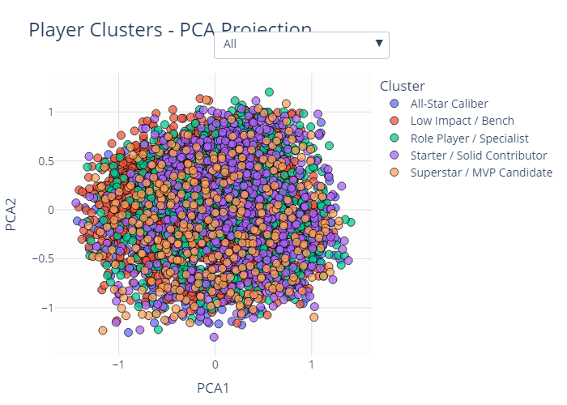
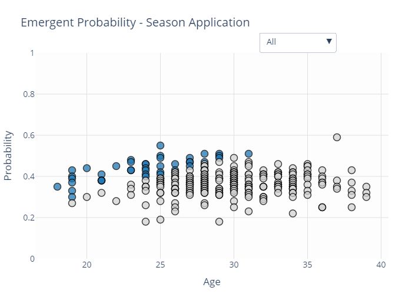

# 🏀 EuroLeague Player Scouting – ML Pipeline

**Authors**: Alessandro Frullo, Giulia Pareschi  
**Goal**: Identify and predict emerging basketball talents in EuroLeague using a modular ML framework.

---

## 📌 Overview

This project implements a **machine learning pipeline** that transforms raw player statistics into actionable scouting insights.  
It predicts future breakout players by combining:

- 🔍 **Unsupervised Clustering** of performance profiles  
- 🧠 **Trajectory-Aware Pseudo-Labeling** for breakout detection  
- 🤖 **Supervised Learning** to forecast emergence  
- 📈 **Interactive Visualizations** for analysis  

We thank [Hackastat](https://www.hackastat.eu) for providing data and [EuroLeague](https://www.euroleaguebasketball.net) for the context that inspired this project.

---

## 🔁 Pipeline Phases

### **Phase 0 – Raw Data Processing**
- Parse Excel stat sheets across seasons
- Harmonize columns and formats
- Export unified `.pkl` datasets

### **Phase 1 – Clustering Player Profiles**
- Filter significant contributors
- Normalize stats and compute **PII**
- Cluster players with KMeans + PCA
- Assign interpretative labels

📷 **Cluster Projection**  

  
   
  <a href="img/player_clusters_pca_interactive.html">🔗 Interactive Version</a>

### **Phase 2 – Career-Based Pseudo-Labeling**
- Track cluster progression across seasons
- Detect breakout trajectories (low → top cluster)
- Compute an **Emergence Score**
- Label top rookies dynamically

---

### **Phase 3 – Supervised Dataset Construction**
- Match features and emergence labels
- Create deltas (ΔPTS, ΔPER, ...) and flags (U23)
- Support both **seasonal** and **career** label modes

### **Phase 4 – Predictive Modeling**
- Train classifiers:
  - Logistic Regression
  - Random Forest
  - XGBoost
- Optimize thresholds
- Analyze feature importances

📷 **Top Feature Importances**  

  

---

### **Phase 5 – Apply to New Season**
- Apply trained model to new season data
- Predict breakout probability for 2024–2025

📷 **Emergence Forecast (2024)**  

  
   
  <a href="img/emergent_predictions_interactive.html">🔗 Interactive Version</a>

---

## 🧠 Key Features Considered

- `PTS/G`, `PER`, `TS%`, `AST%`, `TR%`, `USG%`, `TO Ratio`, `AGE`
- Δ (season-to-season improvement)
- Player context (role, minutes, team win%)

---

## ✅ Why This Matters

- 🚫 No manual labels: fully automatic
- 📈 Grounded in historical progression
- 🧩 Modular & adaptable to any league
- 🔎 High interpretability for real scouting

---

## 📂 Repository Structure

.
├── img/
├── keys/
├── models/
├── output/
├── src/
│ ├── clean/
│ └── raw/
│   ├── 23 24
│   ├── 24 25
│   └── all time
├── utils/
│ ├── phase0_tools.py
│ ├── phase1_tools.py
│ ├── phase2_tools.py
│ ├── phase3_tools.py
│ ├── phase4_tools.py
│ └── phase5_tools.py
├── ProjectML_Frullo_Pareschi.ipynb
└── README.md
