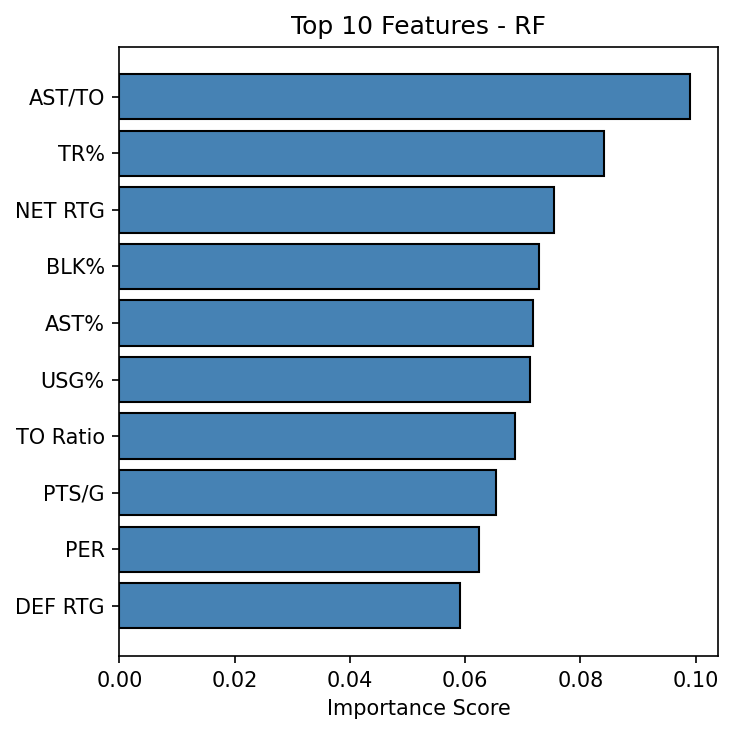

# 🏀 EuroLeague Players Scouting 

[](https://github.com/axeldotf/EuroLeagueScouting/blob/main/root/requirements.txt)

**Authors**: Alessandro Frullo, Giulia Pareschi  
**Goal**: Identify and predict emerging basketball talents in EuroLeague using a modular ML framework.

---

## 📌 Overview

This project implements a **machine learning pipeline** that transforms raw player statistics  
into actionable scouting insights. It predicts future breakout players by combining:

- 🔍 **Unsupervised Clustering** of performance profiles  
- 🧠 **Trajectory-Aware Pseudo-Labeling** for breakout detection  
- 🤖 **Supervised Learning** to forecast emergence  
- 📈 **Interactive Visualizations** for analysis  

We thank [Hackastat](https://www.hackastat.eu) for providing data and  
[EuroLeague](https://www.euroleaguebasketball.net) for the context that inspired this project.

---

## 📊 Project Snapshot

| Item                 | Details                                              |
|----------------------|------------------------------------------------------|
| Domain               | Sports Analytics / Basketball Scouting               |
| Techniques Used      | Clustering, Pseudo-Labeling, Supervised Learning     |
| Data Source          | [Hackastat](https://www.hackastat.eu), [EuroLeague](https://www.euroleaguebasketball.net)   |
| Outputs              | Emergence probabilities for EuroLeague players       |
| Models Used          | Logistic Regression, Random Forest, XGBoost          |
| Development Language | Python 3.11.9                                        |

---

## ⚙️ Installation

Clone the repository and install dependencies:

```bash
git clone https://github.com/axeldotf/EuroLeagueScouting.git
cd EuroLeagueScouting
pip install -r root/requirements.txt
```

---

## 🔁 Pipeline Phases

### **Phase 0 – Raw Data Processing**
- Parse Excel stat sheets across seasons
- Harmonize columns and formats
- Export unified `.pkl` datasets

### **Phase 1 – Clustering Player Profiles**
- Filter significant contributors
- Normalize stats and compute **PII**
- Cluster players with KMeans + PCA
- Assign interpretative labels

📷 **Cluster Projection**  
<div align="center">
  
  <br>
  <a href="https://drive.google.com/file/d/1ykDyCZfoCA7nII0ypF1qLdHKqixb_eib/view?usp=drive_link" target="_blank">📥 Download Interactive HTML (via Google Drive)</a>
</div>

### **Phase 2 – Career-Based Pseudo-Labeling**
- Track cluster progression across seasons
- Detect breakout trajectories (low → top cluster)
- Compute an **Emergence Score**
- Label top rookies dynamically

---

### **Phase 3 – Supervised Dataset Construction**
- Match features and emergence labels
- Create deltas (ΔPTS, ΔPER, ...) and flags (U23)
- Support both **seasonal** and **career** label modes

### **Phase 4 – Predictive Modeling**
- Train classifiers:
  - Logistic Regression
  - Random Forest
  - XGBoost
- Optimize thresholds
- Analyze feature importances

📷 **Top Feature Importances**  
<div align="center">
  
</div>

---

### **Phase 5 – Apply to New Season**
- Apply trained model to new season data
- Predict breakout probability for 2024–2025

📷 **Emergence Forecast using RF**  
<div align="center">
  
  <br>
  <a href="https://drive.google.com/file/d/1ft4-Mj4C-yfWmJc5Njw5aYunlW7J8fQA/view?usp=drive_link" target="_blank">📥 Download Interactive HTML (via Google Drive)</a>
</div>

---

## 🧠 Key Features Considered

- `PTS/G`, `PER`, `TS%`, `AST%`, `TR%`, `USG%`, `TO Ratio`, `AGE`
- Δ (season-to-season improvement)
- Player context (role, minutes, team win%)

---

## ✅ Why This Matters

- 🚫 No manual labels: fully automatic
- 📈 Grounded in historical progression
- 🧩 Modular & adaptable to any league
- 🔎 High interpretability for real scouting
